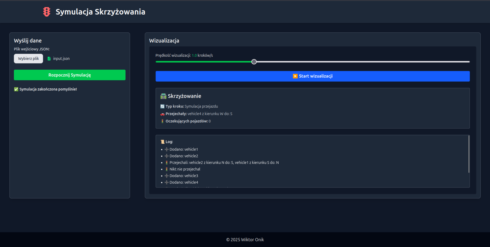

# 🚦 Smart Traffic Simulator

Aplikacja symulująca działanie inteligentnego skrzyżowania z czterema drogami (północ, południe, wschód, zachód). Projekt składa się z backendu w Spring Boot i frontendu w React. Umożliwia uruchomienie symulacji na podstawie pliku JSON oraz jej krokową wizualizację w przeglądarce.
 
## ⚙️ Praca sygnalizacji:
Chcemy aby nasze skrzyżowanie miało wysoką przepustowość i proporcjonalnie "rozładowywało" samochody na każdej z ulic.

Sygnalizacja sprawdza która niekolidująca ze sobą para dróg (wschód-zachód lub północ-południe) zawiera więcej pojazdów. 
Następnie ustawia tej parze światło zielone a pozostałym drogom czerwone. Światło zmieni się kiedy po przejechaniu pewniej
liczby pojazdów to na drugiej parze dróg bedzie ich więcej.
Jest również dodatkowa okolicznośc zmiany światła, gdy jedna para dróg przez długi czas jest "zielona" to ludzie w autach które stoją zaczynają się
niecierpliwić więc po z góry określonym czasie mogą oni przejechać kosztem zatrzymania ruchu na bardziej obleganej parze dróg.


### 🔁 Symulacja:

1. Użytkownik przesyła plik JSON z komendami (`addVehicle`, `step`).
2. Backend (Spring Boot):
   - dodaje pojazdy do kolejek kierunków
   - przeprowadza ruch pojazdów zgodnie z cyklami świateł
   - efekty symulacji są zapisywane do pliku wyściowego


### 🌐 Wizualizacja:

1. Frontend (React) umożliwia przesłanie pliku wejściowego i uruchomienie symulacji.
2. Po zakończeniu, użytkownik może kliknąć **Start wizualizacji**.
3. Kroki symulacji są przedstawiane urzytkownikowi.


## 🚀 Uruchomienie projektu

### ✅ Wersja webowa (frontend + backend)
Aby uruchomić aplikację lokalnie:

Pobierz cały projekt na swój komputer za pomocą polecenia:
 `git clone <link-do-repozytorium>
 `
 
Przejdź do katalogu projektu
 `cd smart-traffic-simulator`
 
Zbuduj aplikację
 `./backend/mvnw clean package`
 
Uruchom aplikację
 `java -jar backend/target/smart-traffic-simulator-0.0.1-SNAPSHOT.jar`

Po kilku sekundach aplikacja będzie dostępna pod adresem:
 `http://localhost:8080`


---

### ⚙️ Wersja CLI (tylko symulacja, bez serwera)

Można uruchomić aplikację z dwoma argumentami (plik wejściowy i wyjściowy):

Pobierz cały projekt na swój komputer za pomocą polecenia:
 `git clone <link-do-repozytorium>
 `
 
Przejdź do katalogu projektu
 `cd smart-traffic-simulator`
 
Zbuduj aplikację
 `./backend/mvnw clean package`
 
Uruchom aplikację
 `java -jar backend/target/smart-traffic-simulator-0.0.1-SNAPSHOT.jar <input.json> <output.json>`

Wynik zostanie zapisany w podanym pliku wyjściowym `<output.json>`.

---


## 🧪 Przykład pliku wejściowego JSON

```json
{
  "commands": [
    {
      "type": "addVehicle",
      "vehicleId": "vehicle1",
      "startRoad": "south",
      "endRoad": "north"
    },
    {
      "type": "step"
    },
    {
      "type": "step"
    }
  ]
}
```

---


## ✅ Technologie

- **Java 17** + **Spring Boot 3**
- **React 19**, **TypeScript**, **TailwindCSS**
- **Maven** do budowy backendu
- **Vite** do frontendowego dev-servera


## 📷 Widok aplikacji



---
## License
This project is released under the MIT License. See the `LICENSE` file for details.

---
